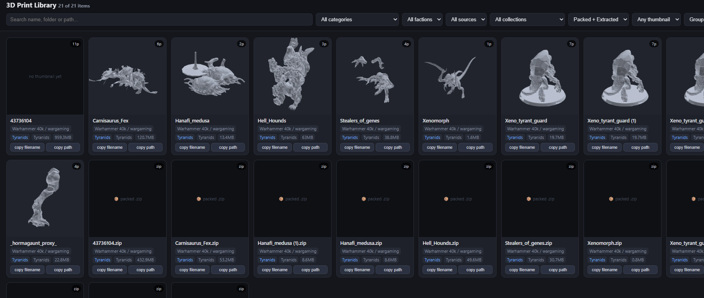

# 3D Model Library

Catalog a large, messy 3D-printing collection into a browsable, searchable gallery — without moving, renaming, or touching a single one of your files.

Built for the situation where you have tens of thousands of STLs spread across drives and cloud folders, you know you own something, and you cannot find it.



---

## What it does

- **Scans folders you choose** for `.stl`, `.obj`, `.3mf`, `.step`/`.stp`, `.ply`, plus `.zip` archives and slicer project files.
- **Groups by project.** A folder containing parts is one entry, not forty.
- **Makes a thumbnail for each project.** Reuses an artist's shipped preview image when one exists; otherwise renders the mesh.
- **Classifies and tags** by category, faction, type and source using keyword rules you control.
- **Builds a self-contained `gallery.html`** — filter, search, group, and copy any item's filename or full path to your clipboard to go find it on disk.
- **Exports `catalog.csv`** for spreadsheets, and `catalog.json` for anything else.

Strictly read-only on your model files. The only things it writes are its own catalog, gallery, and thumbnails.

## Why not just use Explorer

Explorer shows you one folder at a time and can't tell you that the Warhound titan you're hunting is in `- Paid\SomeCreator\April releases-20200426T063026Z-001\`. This gives you every project in one grid, with pictures, filters, and a copy-the-filename button.

---

## Requirements

- Python 3.9+
- Windows for the double-click menu (`LIBRARY.bat`). The Python script itself runs anywhere.

## Install

```bash
git clone https://github.com/njefferson/3dmodel-library.git
cd 3dmodel-library
pip install -r requirements.txt
```

## Quick start

Tell it where your models live:

```bash
python update_catalog.py --add-source "D:\path\to\your\models"
python update_catalog.py --rescan-all
```

That scans, classifies, renders thumbnails, and writes `gallery.html`. Open it in any browser.

On Windows you can skip the commands entirely — double-click **`LIBRARY.bat`** for a numbered menu.

---

## The menu

```
BROWSE           1  gallery          2  spreadsheet
CHECK (safe)     3  status           4  scanned folders   5  test 6 thumbnails
PICTURES         6  make missing     7  redo all
FOLDERS/FILES    8  add folder       9  stop scanning    10  find new files
                11  fix moved       12  remove dead entries
                13  re-apply rules
OTHER            R  refresh          B  back up   U  undo   H  help
```

Anything that writes the catalog copies it into `backups/` first — including the
long picture runs, which are the ones people interrupt. `U` puts the newest copy
back.

## Commands

**Folders to scan**

- `--sources` — list them, with a live OK/MISSING check and an item count each
- `--add-source PATH` — add one
- `--remove-source PATH` — stop scanning one (entries and files both stay)

**Building the catalog**

- `"D:\some\folder"` — scan a folder and fold it into the library
- `--rescan-all` — rescan every listed folder, adding what's new
- `--rebuild-views` — regenerate gallery, CSV and JSON from what's already known; no rendering
- `--reclassify` — re-apply `rules.json` to everything already catalogued
- `--reclassify --dry-run` — show exactly what that would change, and write nothing

**Pictures**

- `--thumbs-only` — make thumbnails only for items that lack one
- `--thumbs-only --force` — rebuild every thumbnail
- `--sample 8` — preview 8 thumbnails into `_render_test/`, changing nothing else
- `--compare-engines 6` — render 6 small models with both engines, side by side
- `--jobs N` — render workers (default: about half your cores)
- `--max-mb N` — skip projects bigger than this (default 1500)
- `--engine shell|mesh` — thumbnail engine (see below)

**When things move or go wrong**

- `--relocate` — find items whose folder moved and update them in place
- `--relocate --prune` — also drop entries whose files are truly gone
- `--diagnose` — what's downloaded, what's cloud-only, what failed and why
- `--backup` — copy `catalog.json` into `backups/` right now
- `--restore-backup` — put the newest backup back (the file it replaces is kept too)

---

## Two thumbnail engines

**`mesh`** (reliable, default in the menu) renders the geometry with trimesh + matplotlib. A couple of seconds per model. Install `fast-simplification` for noticeably cleaner output on high-poly sculpts.

**`shell`** (Windows only) asks Windows for the same thumbnail Explorer shows. Near-instant when it works — but it depends entirely on whether you have an STL thumbnail handler installed, and on some machines it fails for every file. The tool detects that and falls back to `mesh` automatically. It also rejects the case where Windows hands back the same generic icon for everything.

Use `--compare-engines 6` to see which one your machine actually produces better results with.

## Why an item has no picture

Every project carries a status saying what happened to its thumbnail, and it is
in the CSV, in `--diagnose`, on the card in the gallery, and in the filter at the
top of the page. Nothing is skipped silently.

- **reused** — the artist shipped a preview image and it was used as-is
- **shell** / **mesh** — rendered, by the Windows handler or the Python renderer
- **existing** — a picture from an earlier run was already on disk
- **cloud_only** — the files are still online-only placeholders; nothing was opened
- **missing** — the files are not at the recorded path any more
- **too_big** — over `--max-mb`, deliberately deferred
- **unsupported** — `.step`/`.stp`, which nothing here can convert
- **failed** — the renderer ran and produced nothing; the reason is recorded alongside it
- **timeout** — the render was cut off. Unix only for now, since the timeout uses `SIGALRM`

## Cloud storage (Dropbox, OneDrive, Google Drive)

Cataloging works on **metadata only** — filenames and sizes — so it never forces your cloud provider to download anything.

Thumbnails are different: rendering needs the actual bytes. Files that are still online-only are detected via their Windows attributes, skipped without being touched, and reported by `--diagnose`. This is judged per file, not per project: a kit with eight parts downloaded and three still in the cloud renders from the eight, and the other three are not so much as named to the renderer. Mark the folders "available offline", let them sync, then run option 6 again to fill in the gaps. It's resumable — interrupt it whenever you like.

## When you reorganize

Items are identified by a fingerprint of their contents (the set of model filenames, count, and total size), not by path alone. So if you move a folder, scan its new location and run `--relocate`: it recognizes the same kit in a new place, updates the path, and **keeps the existing thumbnail** rather than re-rendering. Ambiguous matches are left alone rather than guessed at.

## Configuring the rules

`rules.json` holds every keyword pattern used for categories, factions, types, and sources. It ships tuned for Warhammer 40k because that's what it was built against — set `"factions": {}` and rewrite `categories` if you catalog something else entirely. Patterns are ordinary case-insensitive regular expressions matched against each item's folder path and name.

Edit it, then apply it to what you already have:

```bash
python update_catalog.py --reclassify --dry-run   # what would change
python update_catalog.py --reclassify             # do it
```

That reads the catalog and rewrites the labels in it. No folder is walked, no model file is opened, no thumbnail is re-made. Put your own patterns in `rules.local.json` instead if you would rather not edit the shipped file — it wins where it exists, and it is gitignored.

## Tests

```bash
python -m unittest discover -s tests -v
```

Builds a catalog from a fixture of tiny STLs in a temp folder and checks the outputs are valid, that no project is ever skipped without a recorded reason, that an interrupted write cannot damage `catalog.json`, that online-only files are never handed to the renderer, and that relocate and prune do what they claim. No third-party packages and no Windows needed — the renderer is not exercised, only everything around it.

Set `LIBRARY_DIR` to keep the catalog, thumbnails and backups somewhere other than next to the script; that is how the tests stay clear of a real library.

---

## Privacy

**Never commit your catalog.** `catalog.json` and `catalog.csv` contain absolute paths to everything you own. `gallery.html` is worse — it embeds the *entire* catalog inline as JSON, so a single file gives away your whole collection and folder structure. And `thumbnails/` holds rendered images of models you may have licensed for personal use only.

The included `.gitignore` excludes all of it, plus `sources.txt` and `backups/`. Publish the tool, not your library. If you fork this and add features, check `git status` before your first commit.

## Known limitations

- **No per-render timeout on Windows.** `SIGALRM` is Unix-only, so a corrupt or gigantic mesh can still stall a worker indefinitely there. `--max-mb` limits the blast radius. This is the next thing to fix.
- `.step`/`.stp` files are catalogued but not thumbnailed — no CAD converter is bundled. They are reported as `unsupported` rather than left blank.
- `.zip` archives are indexed by name only. Nothing is extracted.
- Classification reads the **folder path and name**, not the filenames inside, so a kit in a folder called `KitA` full of `warhound_titan_*.stl` will not be labelled a titan. It is keyword-based and approximate either way; edit `rules.json` and run `--reclassify`.
- `LIBRARY.bat` is Windows-only. Everything it does is available as a command elsewhere, and the Python script itself runs anywhere.

## License

MIT — see [LICENSE](LICENSE).
